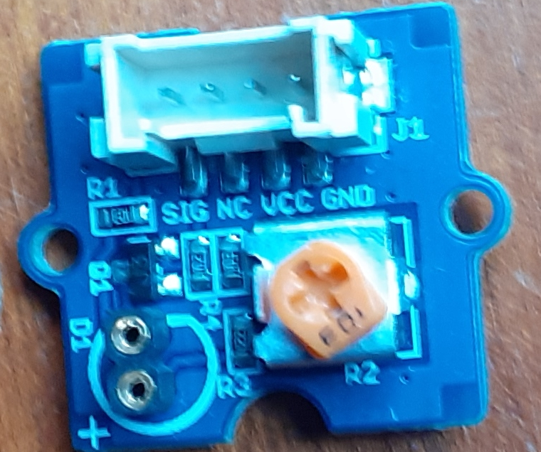
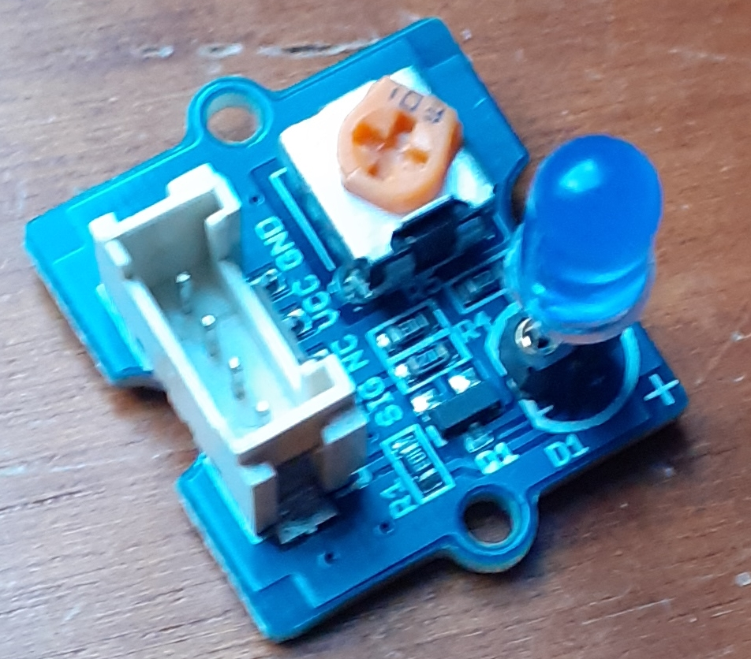
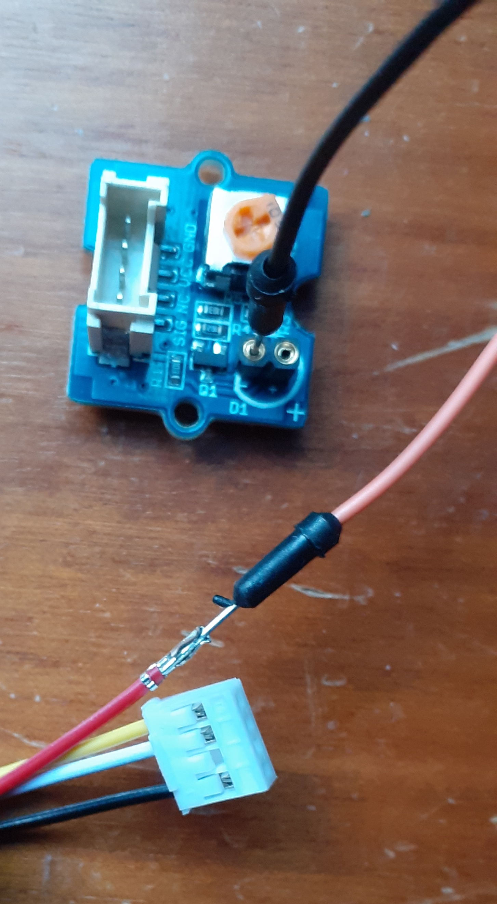
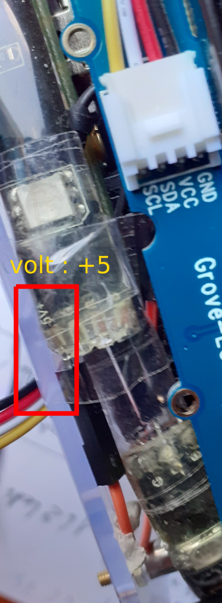
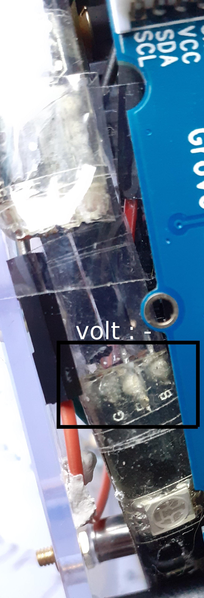
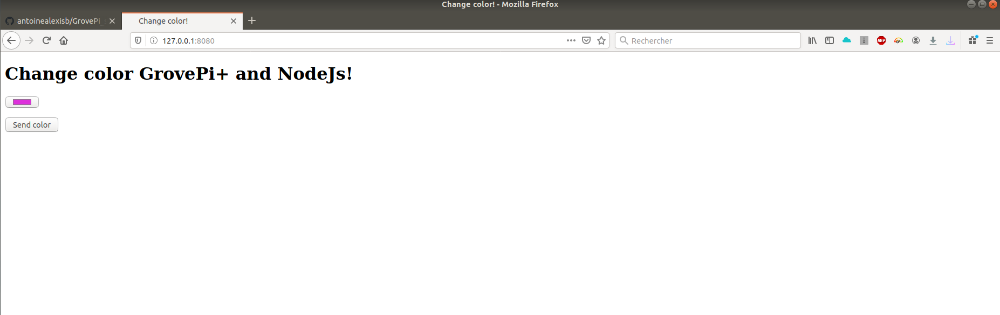

# GrovePi_strip_led
change the color of a led strip with grovePi and NodeJs.  

It is a js, which will create an http server on port 8080 (modifiable) and on the ip address of your machine (to modify in the file so that it corresponds to your ip host machine).  
with a browser, you can access a simple interface web. Inside you can choose the color of your led strip.

## Strip Led

The led strip has 4 pins (Red, Green, Blue and 5v).  
In my case, I connected the Red Pin to pin D5 of the grovePi, Green Pin to pin D6 and Blue Pin to pin D3. So i use 3 **Grove - __ LED** and I connect a cable from "-" to the pin corresponding to the color on my led strip. Regarding the 5v I take it on the red wire which brings the current to the **Grove - __ LED**.

#### Grove - __ LED

  
  

#### cable connection

  

5v connection on the led strip:  
  

ground (pins grounds grovePi Led) connection on the led strip:  
  


## Running locally

just git clone.
```bash
$ git clone https://github.com/antoinealexisb/GrovePi_strip_led.git
$ cd GrovePi_strip_led/
$ npm install
$ nodejs app.js
```

## Website

`website`


`video`
[example in video](https://youtu.be/xndJncuohY8)
